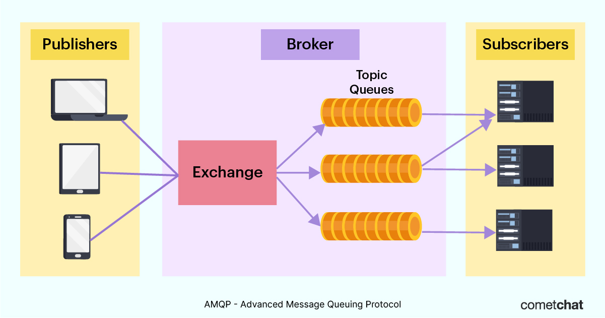

## AMQP
Advanced Message Queing Protocol의 약자로, 흔히 알고 있는 MQ의 오픈소스에 기반한표준 프로토콜을 의미

  

AMQP 이전에도 상용화된 MQ 제품들은 많았지만, 대부분 플랫폼 종속적이었다.
따라서, 서로 다른 이기종간에 메세지를 교환하기 위해서는 메시지 포멧 컨버전을 위한 메시지 브릿지를 이용하거나,  
시스템 자체를 통일시켜야 히는 불편함과 비효율성이 있었다.  
AMQP의 목적은 서로 다른 시스템간에 최대한 효율적인 방법으로 메시지를 교환하기 위한 MQ 프로토콜로 아래와 같은 특징이 있다.  
- 모든 broker들은 같은 방식으로 동작
- 모든 client들은 같은 방식으로 동작
- 네크워크상으로 전송되는 명령어들의 표준화
- 프로그래밍 언어 중립적

